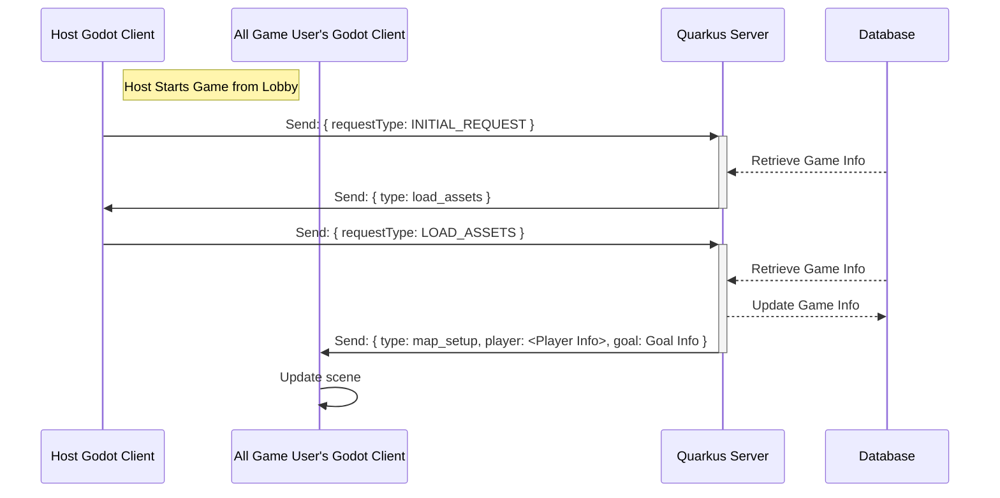

# Backend Lobby Server

This project is an example/POC for the backend Lobby Service of a Godot application. The matching frontend service can be found [here]()

## File Structure

```tree
📦src
 ┣ 📂main
 ┃ ┣ 📂java.org.landister.lobby.backend
 ┃ ┃ ┣ 📂mapper ➊
 ┃ ┃ ┣ 📂model❷
 ┃ ┃ ┃ ┣ 📂dao Ⓐ
 ┃ ┃ ┃ ┣ 📂enums Ⓑ
 ┃ ┃ ┃ ┣ 📂request Ⓒ
 ┃ ┃ ┃ ┣ 📂response Ⓒ
 ┃ ┃ ┃ ┣ 📂session Ⓓ
 ┃ ┃ ┃ ┗ 📂shared Ⓔ
 ┃ ┃ ┣ 📂services
 ┃ ┃ ┣ 📂util
 ┃ ┃ ┗ 📂websocket❸
 ┃ ┃ ┃ ┣ 📂games
 ┃ ┃ ┃ ┃ ┗ 📜WalkingSimulator.java Ⓔ
 ┃ ┃ ┃ ┣ 📜BaseController.java Ⓐ
 ┃ ┃ ┃ ┣ 📜ChatController.java Ⓑ
 ┃ ┃ ┃ ┣ 📜LobbyController.java Ⓒ
 ┃ ┃ ┃ ┗ 📜LoginController.java Ⓓ
 ┃ ┗ 📂resources
 ┃ ┃ ┗ 📜application.properties
 ┣ 📜LICENSE
 ┣ 📜Makefile ❹
 ┣ 📜README.md
 ┣ 📜pom.xml
 ```

<sub>
1. **mappers:** A set of Mappers used to translate to/from a DTO(Data Transfer Object) to a Request or Response
2. **model:** POJOs representing different pieces of the application
    - A. Database Objects
    - B. Shared Enums used across our model
    - C. **request**: Client to Server request/ **response**: Server to Client responses
    - D. Used to save user information for in-memory cache
    - E. Inner objects shared across our model
3. **websocket:** WebSocket Connection Controllers
    - A. **BaseController:** Controller that is extended by all the other Websocket Controllers (except login). This is where our common logic lives
    - B. **ChatController:** Extended by controllers that use the chat functionality. Contains logic for sending messages to specific users and all users in a game
    - C. **LobbyController:** Controller backing the initial login screen
    - D. **LoginController:** Controller backing the main lobby, and game lobby screen
    - E. **WalkingSimulator:** Controller backing our example game
4. **MakeFile** File used to easily run our different commands
</sub>

## Running the application in dev mode

You can run your application in dev mode that enables live coding using:
```shell script
./mvnw compile quarkus:dev
```

> **_NOTE:_**  Quarkus now ships with a Dev UI, which is available in dev mode only at http://localhost:8080/q/dev/.

## Running Application On DigitalOcean

There are lots of ways to deploy your application on the interwebs. I have used Google Cloud and you should be able to get that working for free, and I think that AWS has some free options. But I have recently started playing around with [Digital Ocean](cloud.digitalocean.com) and I have really like the interface and simplicity of it. The pricing is also very reasonable and if you are just creating a couple dropplets for your initial POC it is easy to turn them off and on so I am going to write the guide below assuming that you are using the DigitalOcean products and are new.

### Create Container Repository

DigitalOcean offers a way to create a container repository. The free level lets you create a single repo, should be able to follow the direction to get authenticated.

>**Note:** I chose to stick with the normal `docker` tool rather than their provided `doctl` cli.

### Build Image And Push

Now that we are connected to our Image Registry we just need to build our image and push. Quarkus creates a couple different docker files for us, we are going to use the `src/main/docker/Dockerfile.jvm` file for our build. The `native` file is only intended for serverless use which we do not want for our application.

Run the Docker Commands:

```sh
docker build -f src/main/docker/Dockerfile.jvm . -t registry.digitalocean.com/<YOUR_REPO_NAME>/lobby-example
docker push registry.digitalocean.com/<YOUR_REPO_NAME>/lobby-example
```

```sh
make build-docker-image:
```

### Create a Dropplet

Navigate to Dropplets on the side and choose "Create Dropplet"


## Related Guides

- WebSockets ([guide](https://quarkus.io/guides/websockets)): WebSocket communication channel support

## Game States


